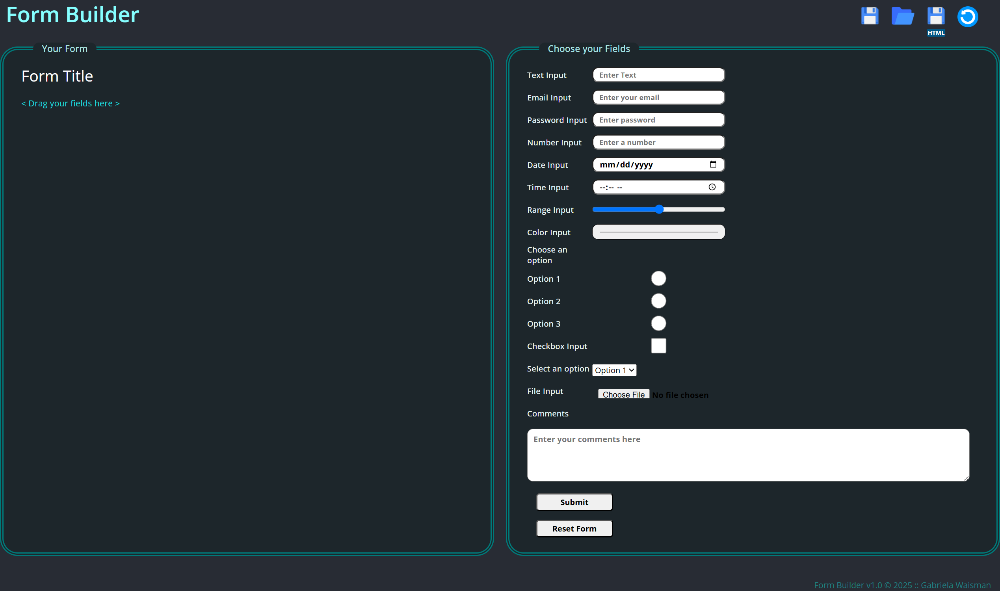

Form Builder
============

This is an app to create custom HTML forms by dragging and dropping fields and exporting them to be used in your websites' code. Created in React.
Desktop version for now.

## View app on working site 

[link] (https://gabywaisman.com/portfolio/form-builder/index.html)

## How to run the app locally

Download and open the project folder.
Run in the command line: 

### `npm start`

Runs the app in the development mode.\
Open [http://localhost:3000](http://localhost:3000) to view it in your browser.

The page will reload when you make changes.\
You may also see any lint errors in the console.

## Screenshots

Initial State when you open the app:

Building a custom form with drag & drop:

Saving a file:

